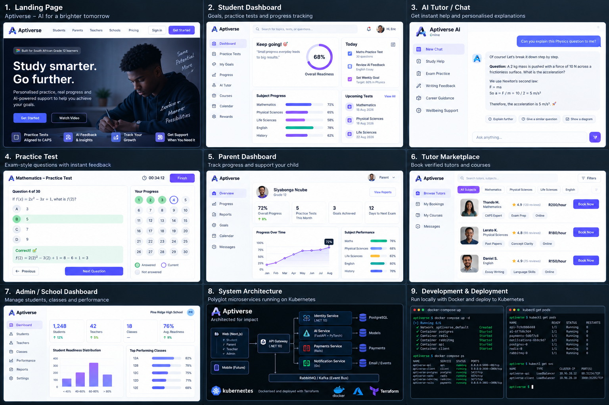

# Aptiverse

An AI-powered student success platform for South African Grade 12 learners —
personalised practice, progress tracking and AI-assisted support, aligned to
the CAPS curriculum.

Live at **[aptiverse.co.za](https://aptiverse.co.za/)**.

## Screenshots



## What's in this repository

| Path | Service | Stack |
|---|---|---|
| `web/` | Web application — student, parent, teacher and school-admin experiences | Next.js, TypeScript |
| `api/` | Core API — auth, goals, practice, analytics, payments, marketplace | .NET 10, Entity Framework |
| `ai/` | AI service — practice generation, feedback and explanation | FastAPI, Python |
| `infra/` | Local compose stack and AWS Terraform (EC2 + RDS) | Docker, Terraform |

The `api/` service is modular rather than monolithic: `api/Modules/` splits the
domain into academic planning, practice, goals, mastery, marketplace, booking,
insights and more, each with its own application/domain/infrastructure layers.

The architecture diagram above shows the platform as a whole. Some services in
it — the Rails payment gateway, the Go notification and event services — live
in their own repositories alongside this one rather than in this monorepo.

## Running locally

```bash
cd infra
cp .env.example .env          # fill in POSTGRES_USER / POSTGRES_PASSWORD
docker compose up -d          # postgres + redis on localhost:5432 / 6379
```

Then run each service against that stack:

```bash
cd api  && dotnet run          # .NET API
cd ai   && uvicorn app.main:app --reload
cd web  && npm install && npm run dev
```

## Deployment

The web app is hosted on Vercel. The API and its supporting services run on
AWS, provisioned by the Terraform in `infra/terraform/` (EC2 + RDS in the
`af-south-1` region), with images published to GHCR by the workflow in
`api/.github/workflows/`.

See `infra/README.md` for the full deployment procedure.

## Documentation

- `DESIGN_BRIEF.md` — product and design direction
- `ENTERPRISE_SWEEP.md` — hardening and readiness review
